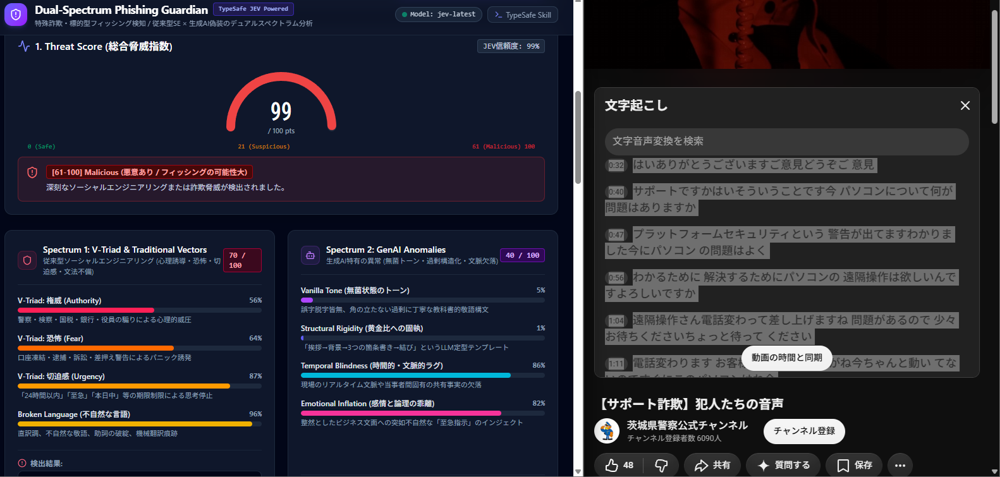

# JEV-Dual-Spectrum Phishing Guardian

> **TypeSafe AI (JEV System One) 高速推論エンジン搭載**  
> 特殊詐欺・標的型フィッシング検知 / 「従来型ソーシャルエンジニアリング (V-Triad)」×「生成AI偽装リスク」のデュアルスペクトラム分析プラットフォーム

[](https://nodejs.org/)
[](https://www.typescriptlang.org/)
[-purple.svg)](https://typesafe.ai)
[](https://react.dev/)
[](https://tailwindcss.com/)

---



---

## 📌 概要

近年、警察・検察・国税局・サポート窓口などを騙る「劇場型特殊詐欺」に加え、生成AI（LLM）を用いて誤字脱字のない完璧な敬語（Vanilla Tone）や整然とした箇条書きを装う「AI製スピアフィッシング」が急増しています。

従来の検知ツールは「日本語の不自然さ」や「機械翻訳の痕跡」に依存していたため、**「文法的に完璧なAI標的型メール」を見逃す**か、あるいは**「電話口の生々しい威圧スクリプト」を正確に分類できない**という課題がありました。

**Dual-Spectrum Phishing Guardian** は、**TypeSafe AI (JEV System One)** の確定論的かつ確率的な超高速判定を活用し、受信メッセージや通話文字起こしを以下の2つの独立したスペクトラムで同時解析します。

1. **Spectrum 1: V-Triad & Traditional SE Vectors（従来型リスク）**
   - 心理的誘導ベクトルの3大要素（**権威 Authority / 恐怖 Fear / 切迫感 Urgency**）
   - 不自然な日本語・直訳調・助詞破綻の検知
2. **Spectrum 2: GenAI Anomalies（生成AIリスク）**
   - **Vanilla Tone**（無菌トーン：誤字脱字皆無の教科書的敬語構文）
   - **Structural Rigidity**（黄金比への固執：挨拶→背景→3つの箇条書き→結び）
   - **Temporal Blindness**（文脈・リアルタイム事実の欠落）
   - **Emotional Inflation**（整然としたビジネス文面への突如不自然な「至急送金」等の乖離）

---

## 🎯 主な機能

- ⚡ **TypeSafe JEV による超高速判定**:
  LLMの自然言語生成待ちを排し、JEVの厳格なスキーマ（`score`, `choice`, `noul`）によるミリ秒単位の確定論的スコアリング。
- 🛡️ **0〜100pt 総合脅威指数 (Threat Score)**:
  安全（Safe: 0-20）、要警戒（Suspicious: 21-60）、悪意あり（Malicious: 61-100）の3段階判定。
- 📊 **Spectrum 1 & 2 Triad/異常値ブレイクダウン**:
  各ベクトルの確率値（0〜100%）と検出根拠を視覚的プログレスバーでリアルタイム表示。
- 💡 **判定非連動の恒久対抗策（Counter-Measure）**:
  ボットの判別や攻撃者のスクリプトを瓦解させる「例外インジェクション（Turing Test / カマをかける・脱線）」の対比表と要点解説。
- 📋 **ワンクリック・レポート出力**:
  GitHub Markdown形式で整形された診断レポートのクリップボードコピー機能。
- 🔍 **JEV 診断ログドロワー (Auditability)**:
  JEVモデルの内部確率分布（Probabilities）や生推論レスポンスを完全可視化。

---

## 🏗️ システム構成

```
├── server.ts                       # Express バックエンド (ポート 3000)
├── src/
│   ├── server/
│   │   └── analyzeService.ts       # TypeSafe AI (JEV) クライアント・判定ロジック
│   ├── components/
│   │   ├── ThreatGauge.tsx          # 総合脅威指数ゲージ (0-100)
│   │   ├── SpectrumBreakdown.tsx    # Spectrum 1 (V-Triad) & Spectrum 2 (GenAI) 詳細
│   │   ├── ReportView.tsx           # 診断レポート & 例外インジェクション対抗策
│   │   └── JevDiagnosticsDrawer.tsx # JEV監査ドロワー (生データ & 確率分布)
│   ├── presets.ts                  # サンプルシナリオ (警察騙り、サポート詐欺、CEO送金詐欺等)
│   ├── App.tsx                     # メイン UI ダッシュボード
│   └── main.tsx                    # React エントリーポイント
└── metadata.json                   # アプリケーションメタデータ
```

---

## 🚀 クイックスタート

### 前提条件

- **Node.js**: v20.0.0 以上
- **npm** または **pnpm**
- **TypeSafe API Key**: [TypeSafe AI](https://typesafe.ai) で発行されたAPIキー

### 1. リポジトリのクローン & インストール

```bash
git clone https://github.com/your-username/dual-spectrum-phishing-guardian.git
cd dual-spectrum-phishing-guardian

npm install
```

### 2. 環境変数の設定

`.env.example` をコピーして `.env` を作成し、必要なAPIキーを設定します。

```bash
cp .env.example .env
```

```env
# .env
TYPESAFE_API_KEY="your_typesafe_api_key_here"

# (任意) 必要に応じて設定
PORT=3000
```

> **注意**: 本アプリは判定ロジックに `@typesafe-ai/sdk` (JEV System One) を使用しているため、Gemini APIキーがなくとも完全動作します。

### 3. 開発サーバーの起動

```bash
npm run dev
```

ブラウザで `http://localhost:3000` を開きます。

### 4. 本番ビルド & 起動

```bash
npm run build
npm start
```

---

## 🧪 プリセット検証シナリオ

UI上部にあらかじめ検証用の代表的攻撃シナリオが用意されています。

| プリセット名 | 主な攻撃手法 | 検出の狙い |
| :--- | :--- | :--- |
| **警察/検察騙り 特殊詐欺** | 偽捜査官による逮捕令状・口座凍結脅迫 | 典型的な **V-Triad（恐怖・権威・切迫感）** の最大検出 |
| **サポート詐欺（警告音・偽窓口）** | 偽トロイの木馬警告・遠隔駆除・電子マネー要求 | **恐怖（ウイルス感染）** と **切迫感（PC電源を切るな）** の検出 |
| **生成AI製 CEO極秘M&A送金** | 完璧なビジネス敬語と箇条書きによる極秘送金命令 | **Vanilla Tone（無菌敬語）** と **構造的硬直性** の検出 |
| **国税庁 最終差押予告** | 差押え予告・機械翻訳調の敬語・偽納付リンク | **Broken Language（不自然な日本語）** と **切迫感** の検出 |
| **AI生成 IT/SSO認証再設定** | 偽セキュリティSSOログインへの誘導 | **Temporal Blindness（文脈欠落）** と **無菌トーン** の検出 |
| **正常な社内日常業務連絡** | プロジェクト関係者間の自然な連絡・資料共有 | 脅威シグナルなし・**Safe（安全）** 判定のベースライン |

---

## 🛡️ 例外インジェクション（対抗策）の仕組み

攻撃者（またはボット）は事前に用意されたスクリプトやLLMシステムプロンプトに従って被害者を追い込みます。本アプリでは、その進行を物理的・論理的にクラッシュさせる**例外インジェクション（Turing Test）**を例示しています。

```
[攻撃者のスクリプト進行]
  │
  ▼  （「今すぐ安全口座へ送金してください」「24時間以内に全額納付を」）
[例外インジェクションの投入]
  │  「顧問弁護士から折り返しますので、所属と直通番号・上司名を教えてください」
  │  「いま警察署の窓口に来ているので、担当の警察官に電話を代わります」
  │  「本日内線でお話しされた『確認コード』を社内チャットでお送りください」
  ▼
[攻撃者側のシステムエラー]
  └── 追跡不能な匿名性の崩壊 / 現場文脈の欠落によるハルシネーション / 自発的切断
```

---

## 📄 ライセンス

本プロジェクトは [MIT License](LICENSE) の下で公開されています。
